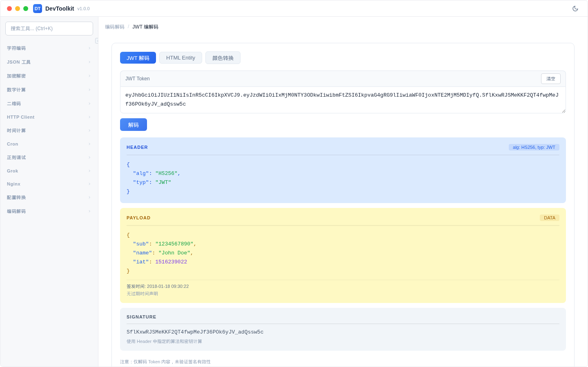

# JWT 编解码

## 功能简介
JWT Token 解码、HTML 实体编解码和颜色格式转换，三个功能通过标签页切换。

## JWT 解码


### 操作步骤
1. 确保「JWT」标签页激活
2. 在输入框粘贴 JWT Token（支持带 `Bearer ` 前缀）
3. 自动解析并显示：
   - Header（头部）：算法和类型
   - Payload（负载）：令牌内容
   - 签名部分
   - 过期状态和过期时间

### JWT 结构
```
Header.Payload.Signature
```
三部分以 `.` 分隔，均为 Base64URL 编码。

### 注意事项
- 此工具仅解码 JWT，不验证签名
- 支持自动去除 `Bearer ` 前缀
- 显示令牌是否过期及过期时间

## HTML 实体编解码


### 功能
- HTML 实体编码：将特殊字符转换为 HTML 实体（如 `<` → `&lt;`）
- HTML 实体解码：将 HTML 实体转换回原始字符

## 颜色转换


### 功能
- 在 HEX、RGB、HSV/HSL 格式之间转换颜色值
- 实时预览颜色