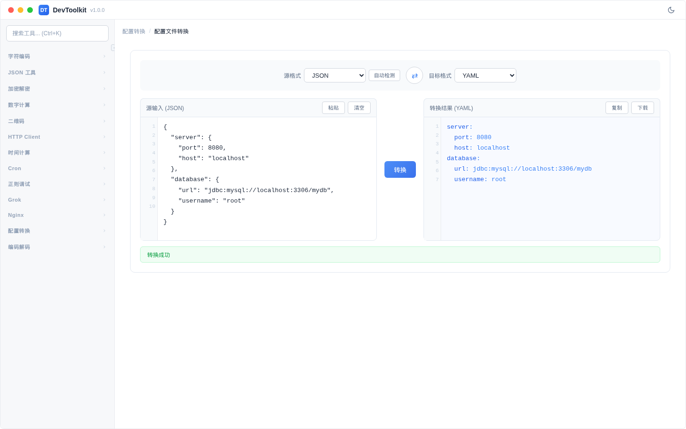

# 配置文件转换

## 功能简介
在 Properties、YAML、JSON 配置文件格式之间相互转换。



## 操作步骤
1. 在输入区域粘贴源格式的配置文件内容
2. 选择源格式和目标格式
3. 点击「转换」按钮
4. 输出区域显示转换后的配置

## 支持的转换

| 源格式 | 目标格式 | 说明 |
|--------|----------|------|
| Properties | JSON | Java Properties → JSON |
| Properties | YAML | Java Properties → YAML |
| YAML | JSON | YAML → JSON |
| YAML | Properties | YAML → Properties |
| JSON | YAML | JSON → YAML |
| JSON | Properties | JSON → Properties |

## 格式说明

### Properties 格式
```properties
server.port=8080
server.host=localhost
database.url=jdbc:mysql://localhost:3306/mydb
database.username=root
```

### YAML 格式
```yaml
server:
  port: 8080
  host: localhost
database:
  url: jdbc:mysql://localhost:3306/mydb
  username: root
```

### JSON 格式
```json
{
  "server": {
    "port": 8080,
    "host": "localhost"
  },
  "database": {
    "url": "jdbc:mysql://localhost:3306/mydb",
    "username": "root"
  }
}
```

## 注意事项
- 转换前会自动校验源格式的语法正确性
- 嵌套层级在 Properties 中以 `.` 分隔表示
- YAML 的注释信息在转换到其他格式时会丢失
- 数值和布尔值会自动推断类型（不会全部作为字符串处理）

## 示例

输入 YAML：
```yaml
server:
  port: 8080
  host: localhost
database:
  url: jdbc:mysql://localhost:3306/mydb
  username: root
```

转换为 Properties：
```properties
server.port=8080
server.host=localhost
database.url=jdbc:mysql://localhost:3306/mydb
database.username=root
```

转换为 JSON：
```json
{
  "server": {
    "port": 8080,
    "host": "localhost"
  },
  "database": {
    "url": "jdbc:mysql://localhost:3306/mydb",
    "username": "root"
  }
}
```
