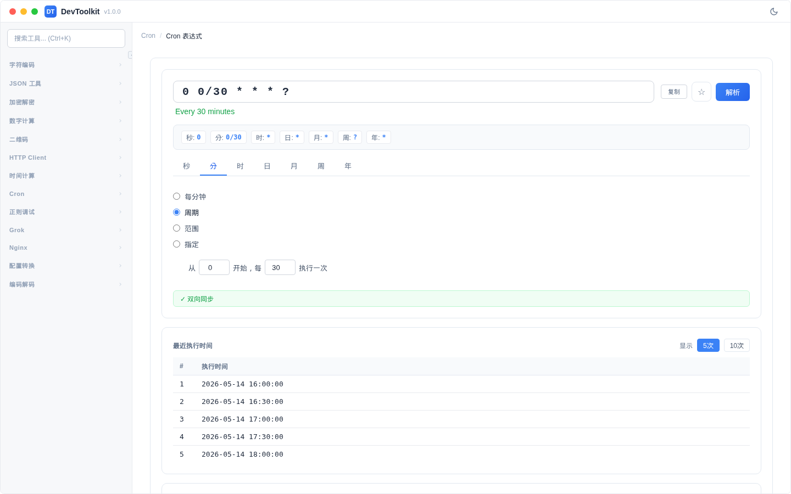

# Cron 表达式编辑器

## 功能简介
可视化编辑和解析 Cron 表达式，支持 7 位（秒级）Cron 表达式。

## 操作步骤
1. 在表达式输入框中输入或修改 Cron 表达式
2. 通过可视化编辑器调整各字段值
3. 查看表达式的人类可读描述
4. 查看最近 N 次执行时间

## 字段说明
Cron 表达式格式：`秒 分 时 日 月 周 [年]`

| 字段 | 范围 | 说明 |
|------|------|------|
| 秒 | 0-59 | 第几秒执行 |
| 分 | 0-59 | 第几分执行 |
| 时 | 0-23 | 第几时执行 |
| 日 | 1-31 | 每月第几天 |
| 月 | 1-12 | 第几月 |
| 周 | 1-7 | 星期几（1=周日） |
| 年 | 2024-2099 | 第几年 |

## 可视化编辑器
每个字段支持以下模式：
- **每X**：固定间隔（如每5分钟）
- **指定**：指定具体值（如第1、3、5秒）
- **范围**：从X到Y（如1-10秒）
- **周期**：从X开始每隔Y（如从0开始每5秒）
- **不指定**：不设置该字段（周和年字段可用）

## 执行次数
设置要显示的最近执行次数（默认 5 次），查看 Cron 表达式接下来将在何时执行。

