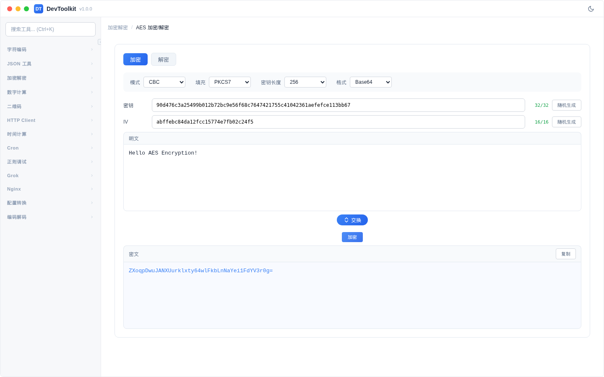

# AES 加密/解密

## 功能简介
AES 对称加密/解密工具，支持多种加密模式。

## 界面说明

页面分为加密和解密两个标签页。

## 加密模式

### 操作步骤
1. 切换到「加密」标签页
2. 在输入区域输入明文
3. 设置加密参数（密钥、IV、模式等）
4. 点击「加密」按钮
5. 输出区域显示密文

### 参数说明
| 参数 | 说明 | 可选值 |
|------|------|--------|
| 模式 | AES 加密模式 | CBC、GCM、CTR、ECB |
| 填充 | 填充方式 | PKCS7、None |
| 密钥长度 | AES 密钥位数 | 128 bit、192 bit、256 bit |
| 输出格式 | 密文输出格式 | Base64、Hex |
| 密钥 | 加密密钥（Hex 格式） | 可点击随机生成 |
| IV | 初始化向量（Hex 格式） | 可点击随机生成，ECB 模式不需要 |

### 密钥长度要求
| 密钥长度 | Hex 字符数 |
|----------|-----------|
| 128 bit | 32 个字符 |
| 192 bit | 48 个字符 |
| 256 bit | 64 个字符 |

### 注意事项
- ECB 模式不需要 IV
- GCM 模式推荐使用 96 bit（24 个 Hex 字符）的 IV
- 密钥和 IV 均为 Hex 格式输入
- 可使用随机生成按钮生成安全的密钥和 IV

## 解密模式
操作与加密相反，输入密文和密钥/IV，输出明文。