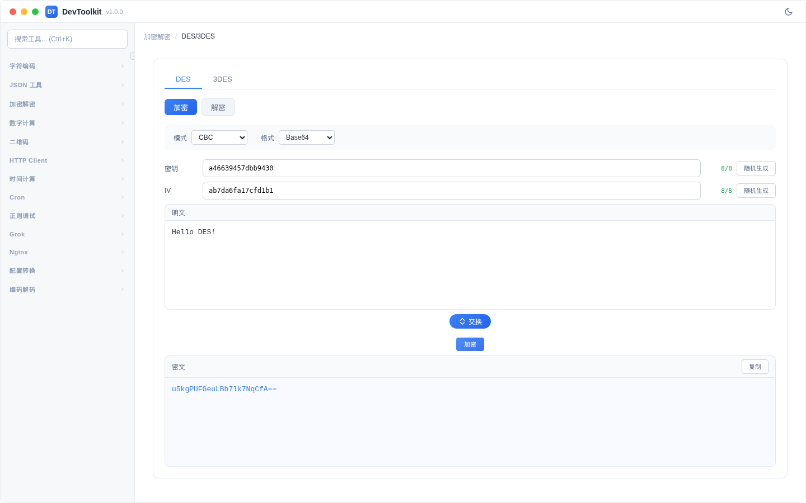

# DES/3DES

## 功能简介
DES 和 3DES 对称加密/解密工具。

## 界面说明

## 算法选择
页面顶部可选择 **DES** 或 **3DES** 算法。

### DES 与 3DES 区别
| 项目 | DES | 3DES |
|------|-----|------|
| 密钥长度 | 8 字节 | 16 或 24 字节 |
| 安全性 | 较低（已不推荐） | 较高 |
| 速度 | 快 | 较慢 |

### 参数说明
| 参数 | 说明 | 可选值 |
|------|------|--------|
| 模式 | 加密模式 | CBC、ECB |
| 密钥长度（3DES） | 三重 DES 密钥长度 | 双倍长（16 字节）、三倍长（24 字节） |
| 输出格式 | 密文输出格式 | Base64、Hex |