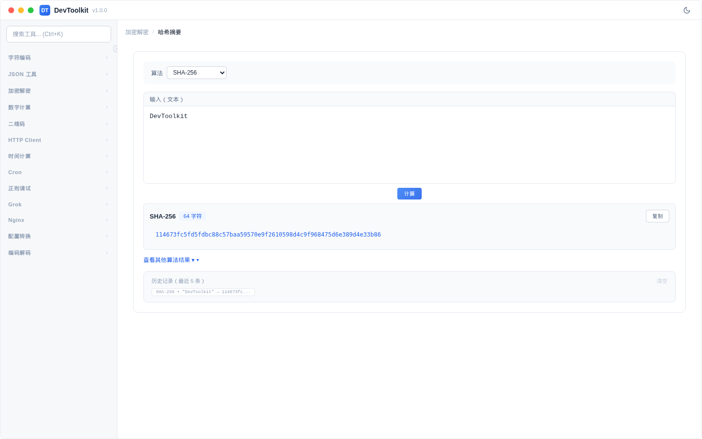

# 哈希摘要

## 功能简介
计算文本的哈希摘要值，支持多种哈希算法。

## 界面说明

## 操作步骤
1. 在输入区域输入文本
2. 选择哈希算法
3. 点击「计算」按钮（或自动计算）
4. 结果区域显示哈希值

### 支持的算法
| 算法 | 说明 | 输出长度 |
|------|------|----------|
| MD5 | 消息摘要算法（不推荐用于安全场景） | 128 bit |
| SHA-1 | 安全哈希算法 1（已不安全） | 160 bit |
| SHA-256 | 安全哈希算法 256 | 256 bit |
| SHA-384 | 安全哈希算法 384 | 384 bit |
| SHA-512 | 安全哈希算法 512 | 512 bit |
| HMAC-SHA256 | 基于密钥的哈希消息认证码 | 256 bit |
| HMAC-SHA384 | 基于密钥的哈希消息认证码 | 384 bit |
| HMAC-SHA512 | 基于密钥的哈希消息认证码 | 512 bit |
| CRC32 | 循环冗余校验 | 32 bit |

### HMAC 模式
选择 HMAC 算法时，需要额外输入密钥（Secret Key）。

### 结果展示
- 主要结果突出显示在顶部
- 可展开查看其他算法的计算结果
- 历史记录保存最近 5 次计算