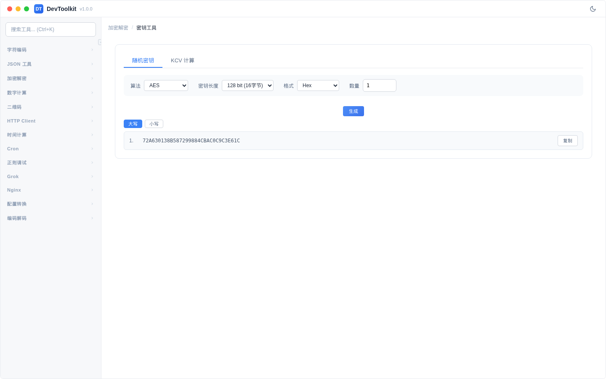
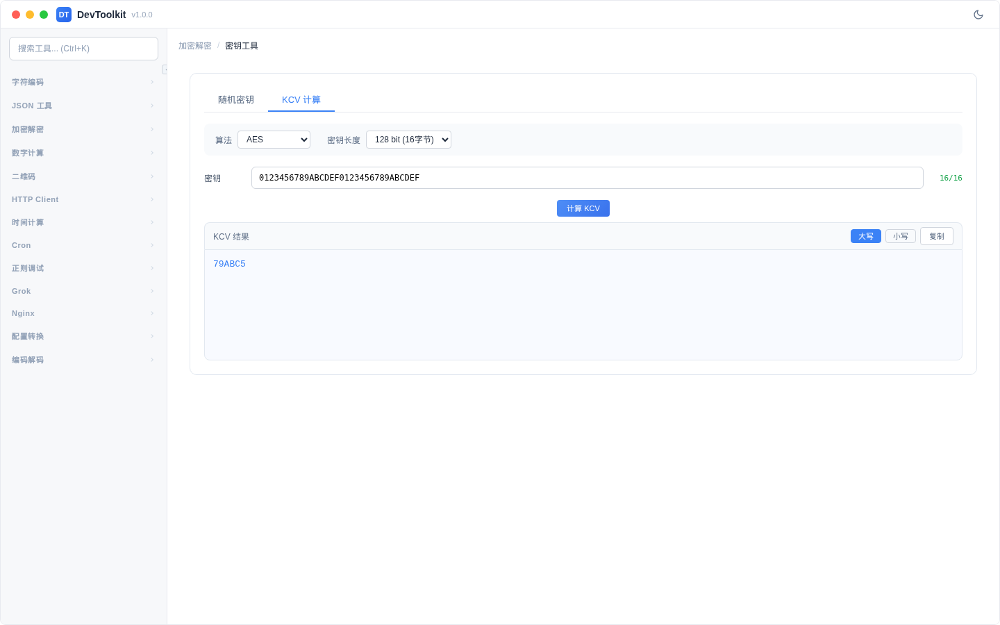

# 密钥工具

## 功能简介
密钥生成和 KCV（Key Check Value）计算工具。

## 随机密钥生成

### 操作步骤
1. 选择算法和密钥参数
2. 设置生成数量
3. 点击「生成」按钮
4. 结果区域显示生成的密钥列表

### 参数说明
| 参数 | 说明 | 可选值 |
|------|------|--------|
| 算法 | 密钥适用的加密算法 | AES、DES/3DES |
| 密钥长度（AES） | AES 密钥位数 | 128 bit、192 bit、256 bit |
| 密钥长度（DES） | DES 密钥长度 | 单倍长（8 字节）、双倍长（16 字节）、三倍长（24 字节） |
| 输出格式 | 密钥输出格式 | Hex、Base64 |
| 数量 | 一次生成的密钥数量 | 1-100 |

### 功能按钮
- **生成**：生成随机密钥
- **批量复制**：复制所有生成的密钥
- **大小写切换**：切换 Hex 输出的大小写

## KCV 计算

### 操作步骤
1. 切换到「KCV」标签页
2. 选择算法和密钥长度
3. 输入密钥（Hex 格式）
4. 点击「计算 KCV」按钮
5. 结果区域显示 KCV 值

### 什么是 KCV
KCV（Key Check Value）是密钥的校验值，通常取密钥加密全零数据的前 3 个字节（6 个 Hex 字符），用于验证密钥输入是否正确。