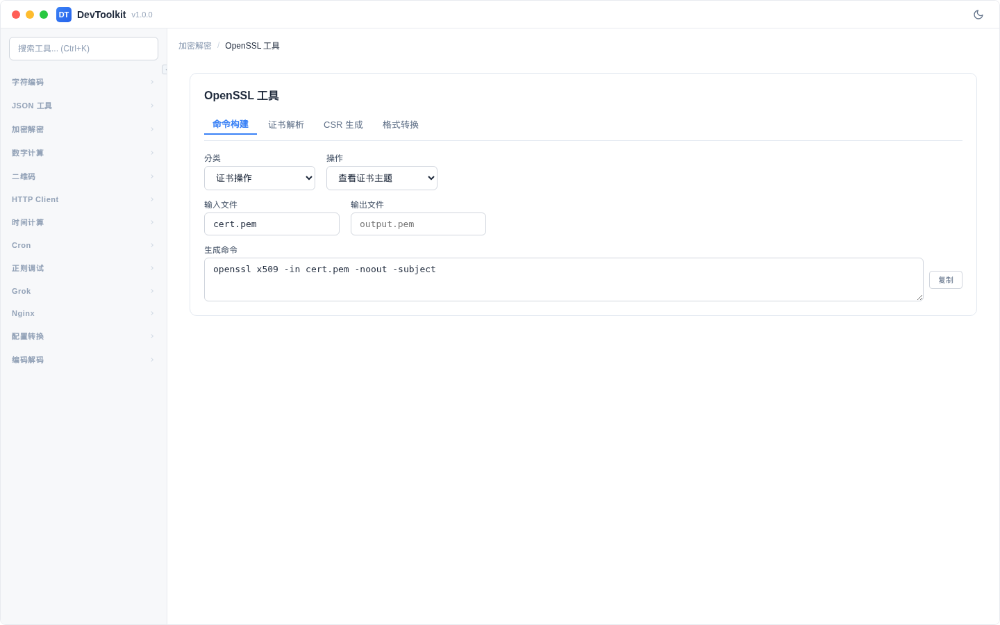
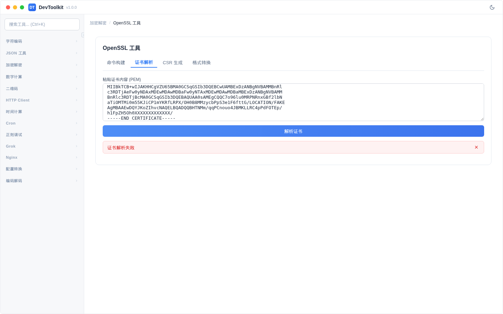
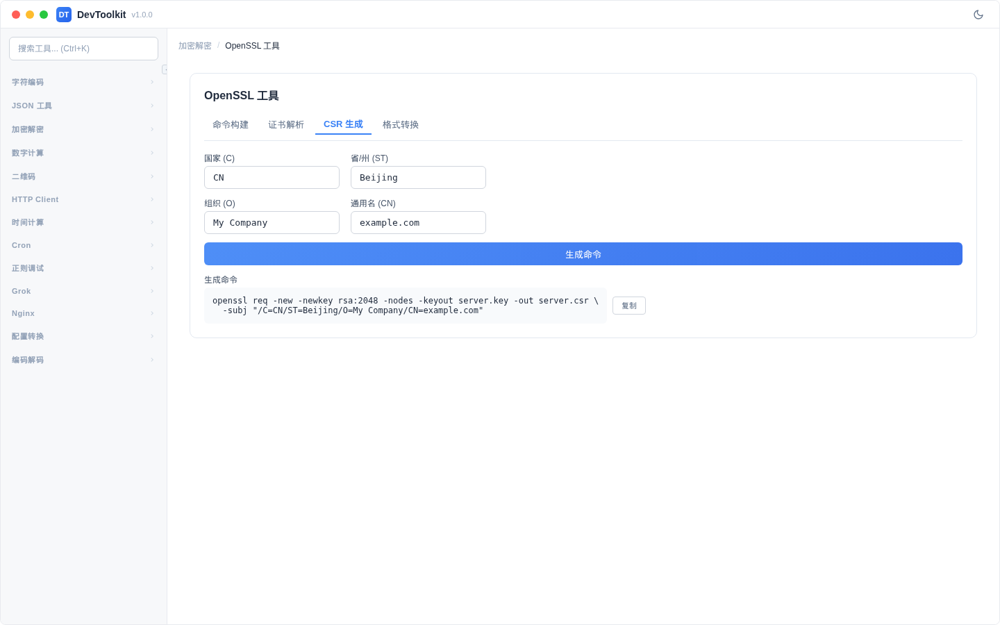

# OpenSSL 工具

## 功能简介
OpenSSL 命令构建、证书解析、CSR 生成和格式转换工具。

## 命令构建

### 操作步骤
1. 选择操作分类（证书操作、密钥操作、CSR 操作）
2. 选择具体操作
3. 填写输入/输出文件名
4. 自动生成 OpenSSL 命令
5. 点击复制按钮复制命令

## 证书解析

### 操作步骤
1. 切换到「证书解析」标签页
2. 在输入区域粘贴 PEM 格式的证书
3. 点击「解析」按钮
4. 显示证书详细信息

### 解析结果字段
| 字段 | 说明 |
|------|------|
| Subject | 证书主题（持有者信息） |
| Issuer | 颁发者 |
| 序列号 | 证书序列号 |
| 有效期 | 起止日期 |
| 签名算法 | 使用的签名算法 |
| 公钥算法 | 使用的公钥算法 |
| SAN | 主题备用名称 |
| 指纹 | 证书指纹（SHA256） |

## CSR 生成

### 操作步骤
1. 切换到「CSR」标签页
2. 填写 CSR 信息（C、ST、O、CN）
3. 自动生成 OpenSSL CSR 生成命令

## 格式转换

### 操作步骤
1. 切换到「格式转换」标签页
2. 选择源格式和目标格式
3. 粘贴证书/密钥内容
4. 点击「转换」按钮

### 支持的格式转换
| 源格式 | 目标格式 |
|--------|----------|
| PEM | DER、PKCS7 |
| DER | PEM、PKCS7 |
| PKCS7 | PEM、DER |