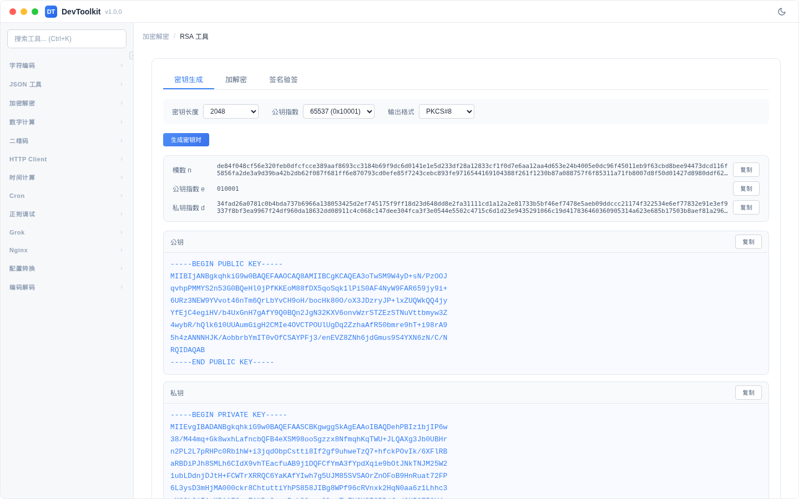
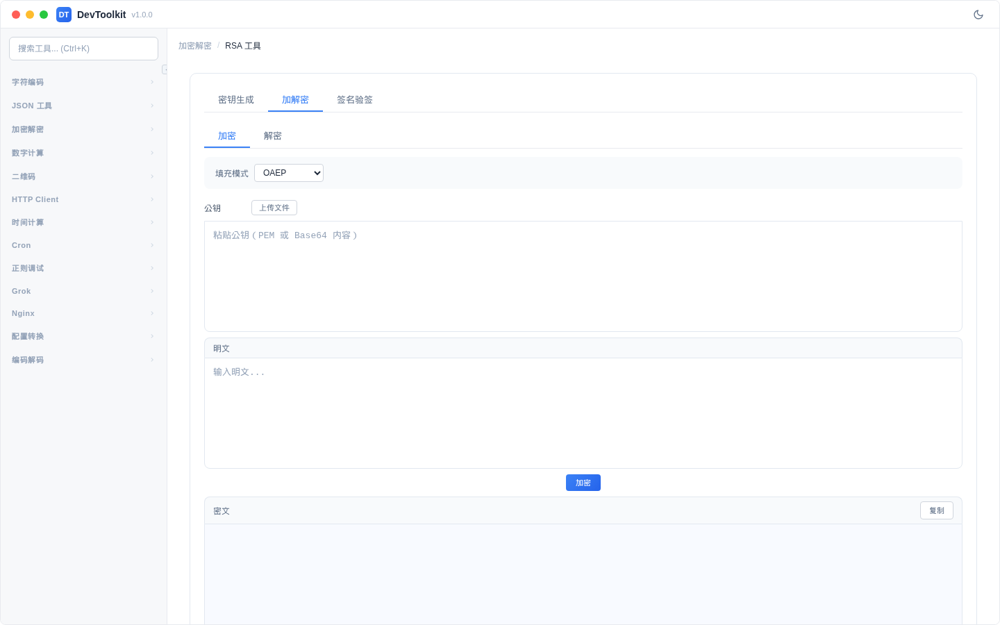
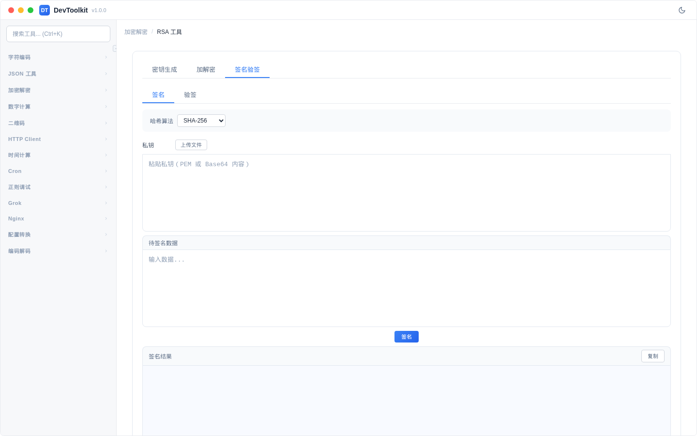

# RSA 工具

## 功能简介
RSA 非对称加密工具，支持密钥生成、加解密和签名验签三大功能。

## 功能标签页

### 密钥生成

#### 操作步骤
1. 选择密钥参数
2. 点击「生成密钥对」按钮
3. 输出区域显示公钥和私钥

#### 参数说明
| 参数 | 说明 | 可选值 |
|------|------|--------|
| 密钥长度 | RSA 密钥位数 | 1024、2048、4096 |
| 公钥指数 | 公开指数 | 3、17、65537 |
| 输出格式 | 密钥输出格式 | PKCS8、PKCS1 |

#### 注意事项
- 1024 位密钥已不安全，推荐使用 2048 或 4096 位
- 65537 是最常用的公钥指数
- 可通过上传按钮导入已有密钥文件

### 加解密

分为加密和解密两个子标签：
- **加密**：使用公钥加密数据
- **解密**：使用私钥解密数据

#### 参数说明
| 参数 | 说明 |
|------|------|
| 填充方式 | OAEP、PKCS1 |
| 输入格式（解密） | Base64、Hex |

### 签名验签

分为签名和验签两个子标签：
- **签名**：使用私钥对数据进行签名
- **验签**：使用公钥验证签名

#### 参数说明
| 参数 | 说明 |
|------|------|
| 哈希算法 | SHA256、SHA384、SHA512 |