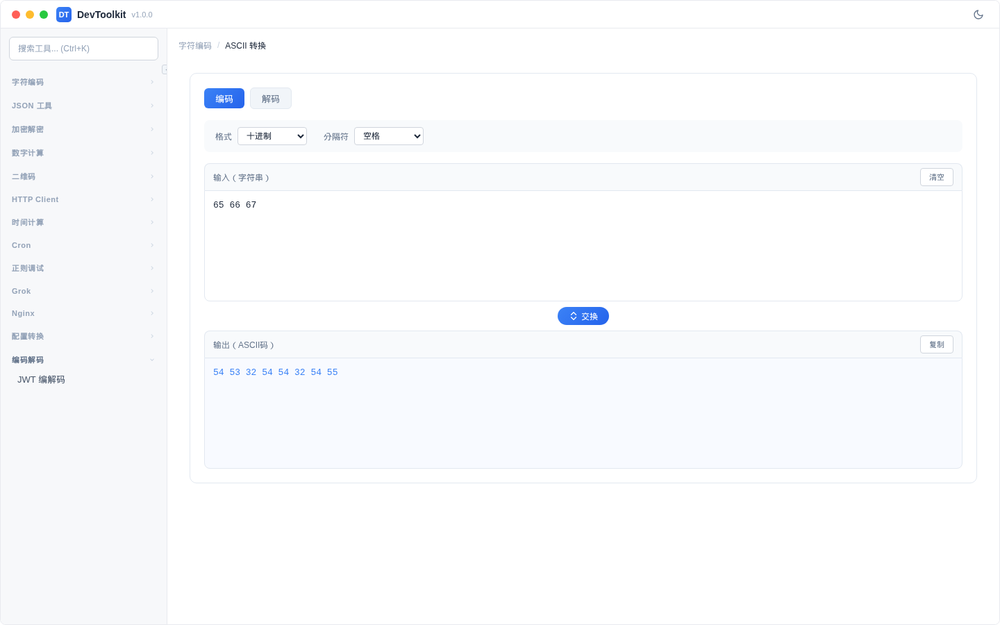

# ASCII 转换

## 功能简介
字符串与 ASCII 码的相互转换。

## 编码模式

### 参数说明
| 参数 | 说明 | 可选值 |
|------|------|--------|
| 输出格式 | ASCII 码的数值格式 | 十进制、十六进制、八进制、二进制 |
| 分隔符 | ASCII 码之间的分隔方式 | 空格、逗号、无 |

## 解码模式

### 注意事项
- 仅支持标准 ASCII 字符（0-127）
- 高位字符（128-255）不属于 ASCII 范围