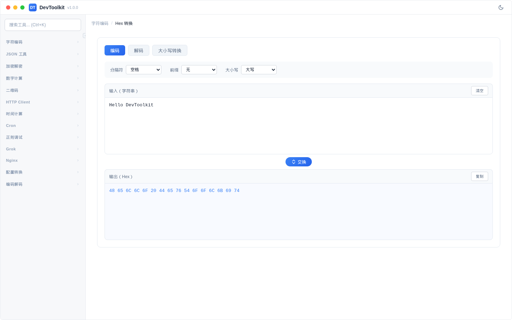
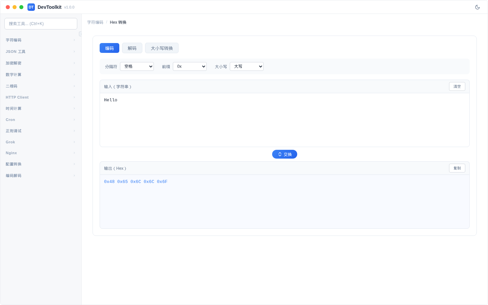
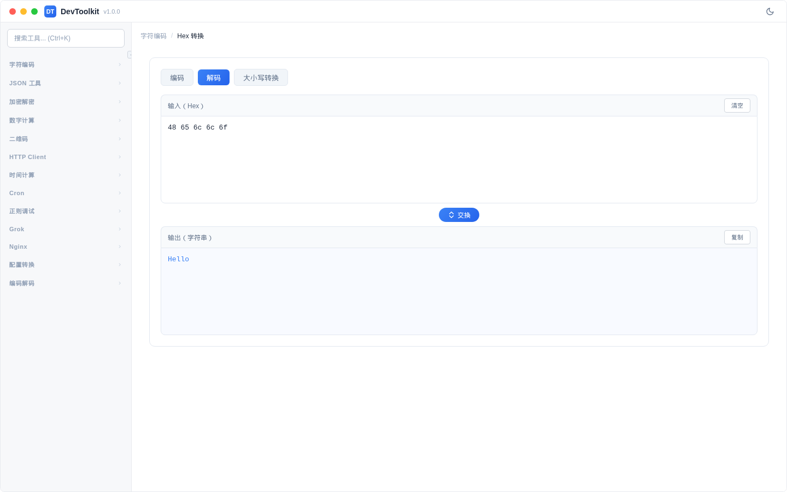
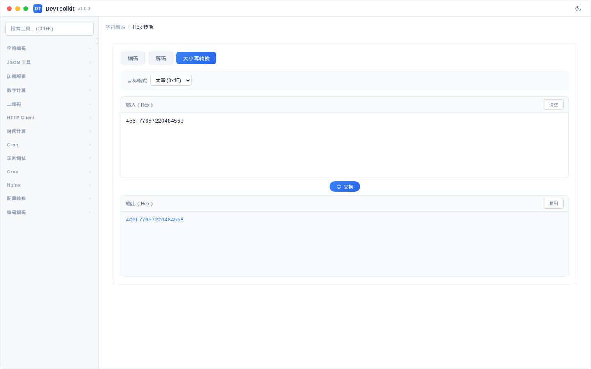

# Hex 转换

## 功能简介
字符串与十六进制 (Hex) 的相互转换。

## 界面说明

页面分为三个 Tab：**编码**（字符串 → Hex）、**解码**（Hex → 字符串）和 **大小写转换**（Hex 大/小写切换）。

## 编码模式

### 操作步骤
1. 确保当前在「编码」标签页
2. 在输入区域输入要转换的字符串
3. 结果自动显示在输出区域
4. 点击输出区域的复制按钮可复制结果

### 参数说明
| 参数 | 说明 | 可选值 |
|------|------|--------|
| 分隔符 | Hex 字节之间的分隔方式 | 空格、逗号、无 |
| 前缀 | 每个字节的前缀标识 | 无、`0x`、`\x` |
| 大小写 | Hex 字母的大小写 | 大写、小写 |

### 示例
输入 `Hello DevToolkit`，使用默认设置（空格分隔、无前缀、大写），输出：`48 65 6C 6C 6F 20 44 65 76 54 6F 6F 6C 6B 69 74`

## 解码模式

### 操作步骤
1. 切换到「解码」标签页
2. 在输入区域输入 Hex 字符串（如 `48 65 6C 6C 6F`）
3. 结果自动显示为原始字符串

## 大小写转换

### 操作步骤
1. 切换到「大小写转换」标签页
2. 在输入区域输入 Hex 字符串
3. 在选项面板选择目标格式：大写或小写
4. 结果自动显示转换后的 Hex

### 参数说明
| 参数 | 说明 | 可选值 |
|------|------|--------|
| 目标格式 | 转换后的 Hex 大小写 | 大写 (`0x4F`)、小写 (`0x4f`) |

### 示例
输入 `4c6f77657220484558`，选择「大写」→ 输出 `4C6F77657220484558`
输入 `4C6F77657220484558`，选择「小写」→ 输出 `4c6f77657220484558`

输入中的非 Hex 字符（如空格、`0x` 前缀等）会自动过滤。