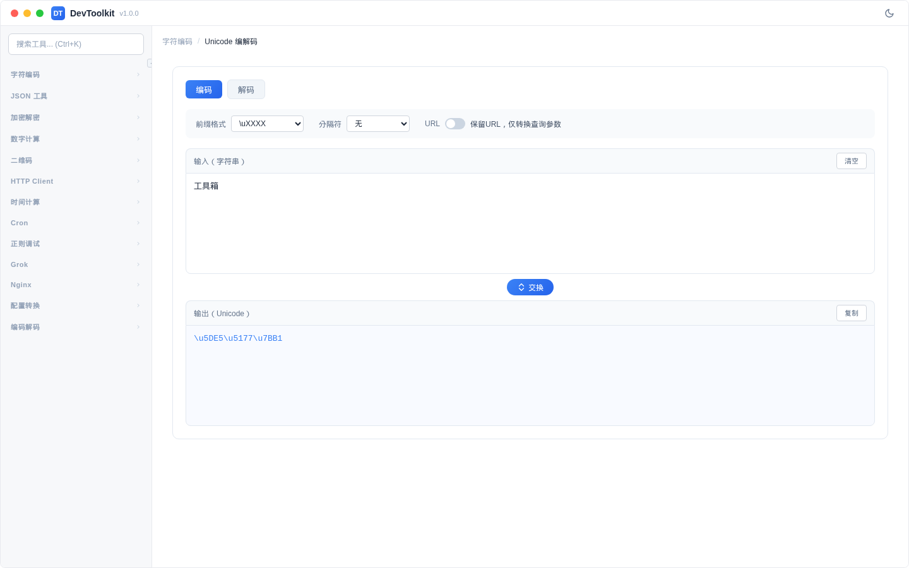
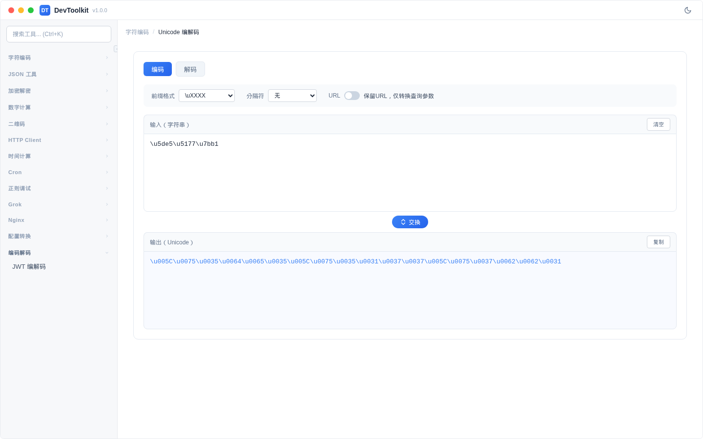

# Unicode 编解码

## 功能简介
字符串与 Unicode 转义序列的相互转换。

## 编码模式

### 参数说明
| 参数 | 说明 | 可选值 |
|------|------|--------|
| 前缀格式 | Unicode 转义前缀 | `\uXXXX`、`\UXXXXXXXX`、`&#xHH;`、`U+XXXX` |
| 分隔符 | 转义序列之间的分隔 | 无、空格、逗号 |
| 保留 URL | 编码时保留 URL 结构 | 开/关 |

## 解码模式

### 注意事项
- 自动处理代理对（surrogate pairs）
- 保留 URL 选项仅在编码模式下可用