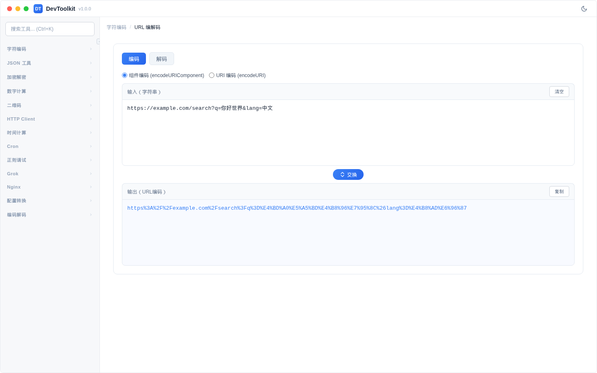
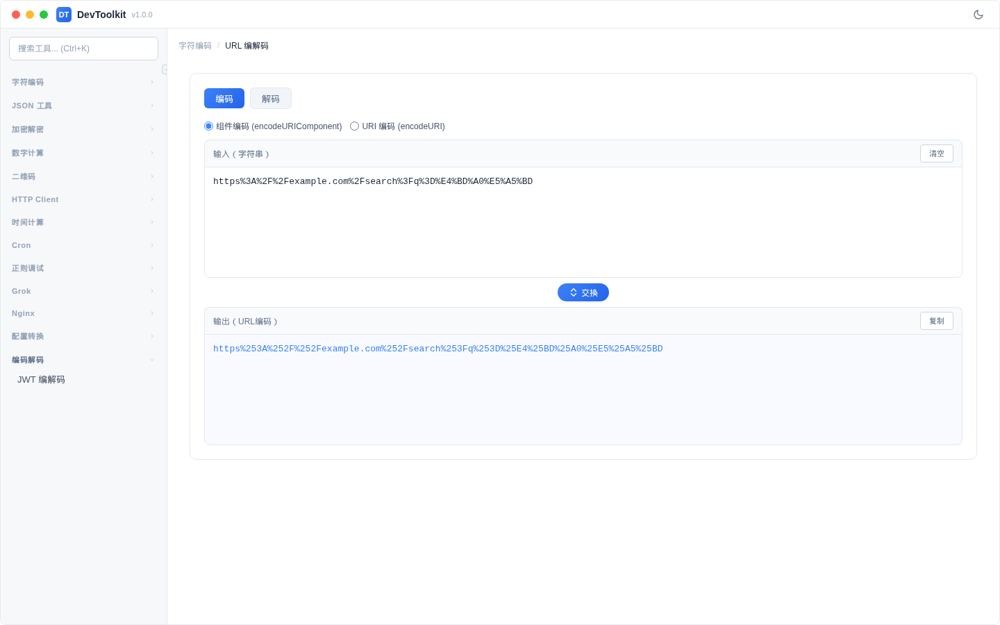

# URL 编解码

## 功能简介
URL 的编码与解码转换。

## 编码模式

### 编码方式
| 方式 | 说明 | 对应方法 |
|------|------|----------|
| 组件编码 | 编码所有特殊字符 | `encodeURIComponent` |
| URI 编码 | 保留 URL 结构字符（:/?&=等） | `encodeURI` |

## 解码模式
