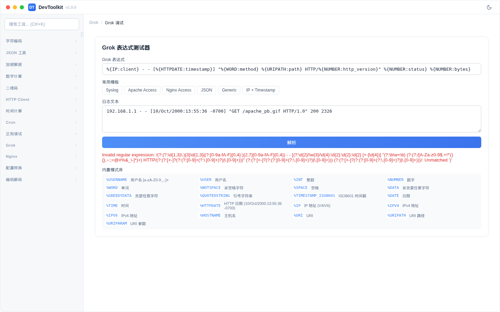

# Grok 调试

## 功能简介
使用 Grok 模式解析日志文本，提取结构化字段。



## 操作步骤
1. 在日志文本区域输入原始日志
2. 在 Grok 模式输入框中输入 Grok 表达式
3. 点击「解析」按钮
4. 查看提取的字段结果

### 常用 Grok 模式
| 模式 | 说明 | 匹配示例 |
|------|------|----------|
| `%{IP}` | IP 地址 | 192.168.1.1 |
| `%{HTTPDATE}` | HTTP 日期 | 10/Oct/2000:13:55:36 -0700 |
| `%{WORD}` | 单词 | GET |
| `%{URIPATH}` | URI 路径 | /apache_pb.gif |
| `%{NUMBER}` | 数字 | 200 |
| `%{QUOTEDSTRING}` | 带引号的字符串 | "GET /path HTTP/1.0" |

### 示例
日志：
```
192.168.1.1 - - [10/Oct/2000:13:55:36 -0700] "GET /apache_pb.gif HTTP/1.0" 200 2326
```

Grok 模式：
```
%{IP:client} - - \[%{HTTPDATE:timestamp}\] "%{WORD:method} %{URIPATH:path} HTTP/%{NUMBER:http_version}" %{NUMBER:status} %{NUMBER:bytes}
```

提取结果：
- client: 192.168.1.1
- timestamp: 10/Oct/2000:13:55:36 -0700
- method: GET
- path: /apache_pb.gif
- http_version: 1.0
- status: 200
- bytes: 2326