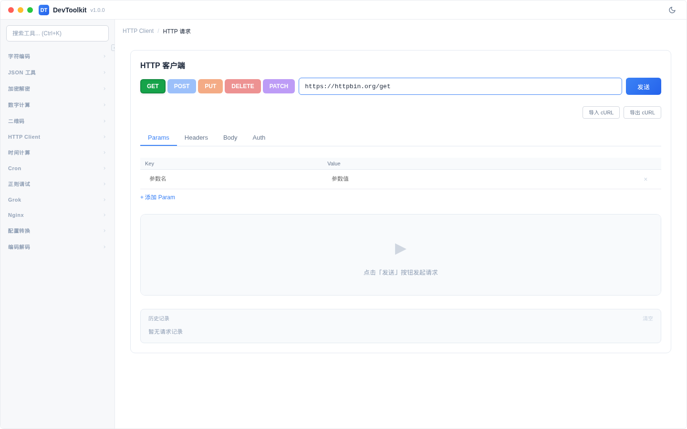
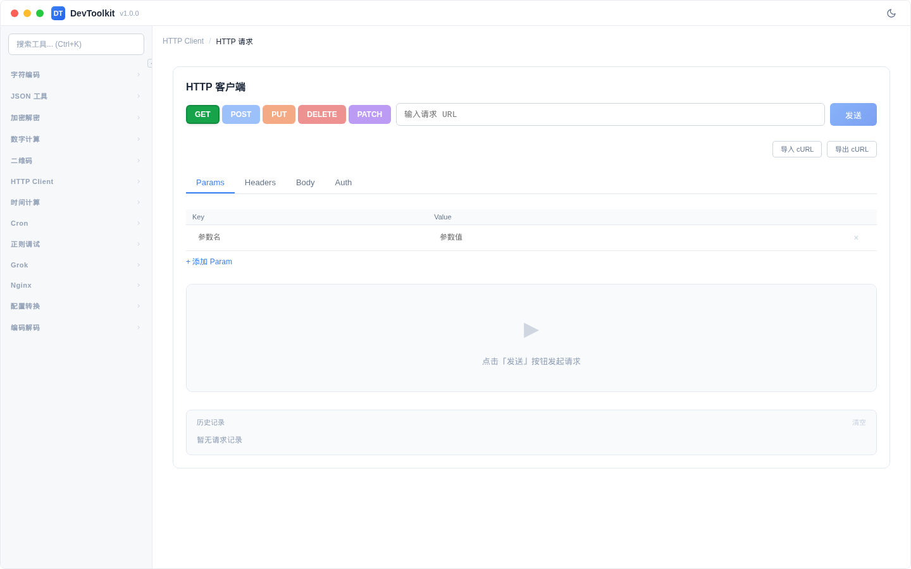
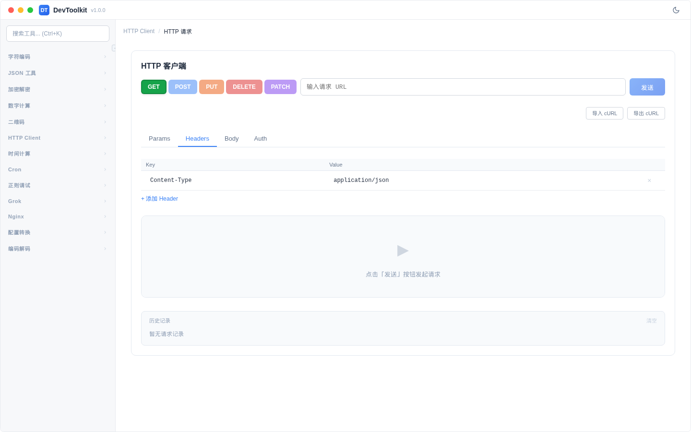
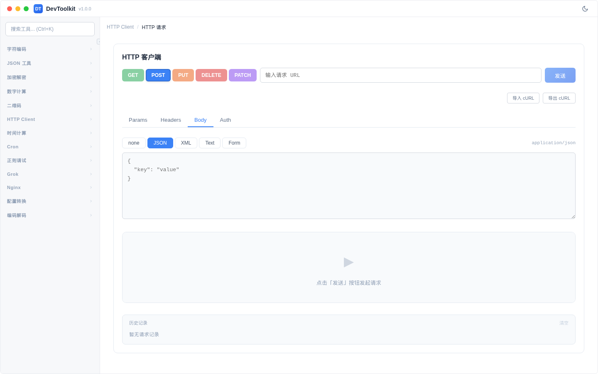
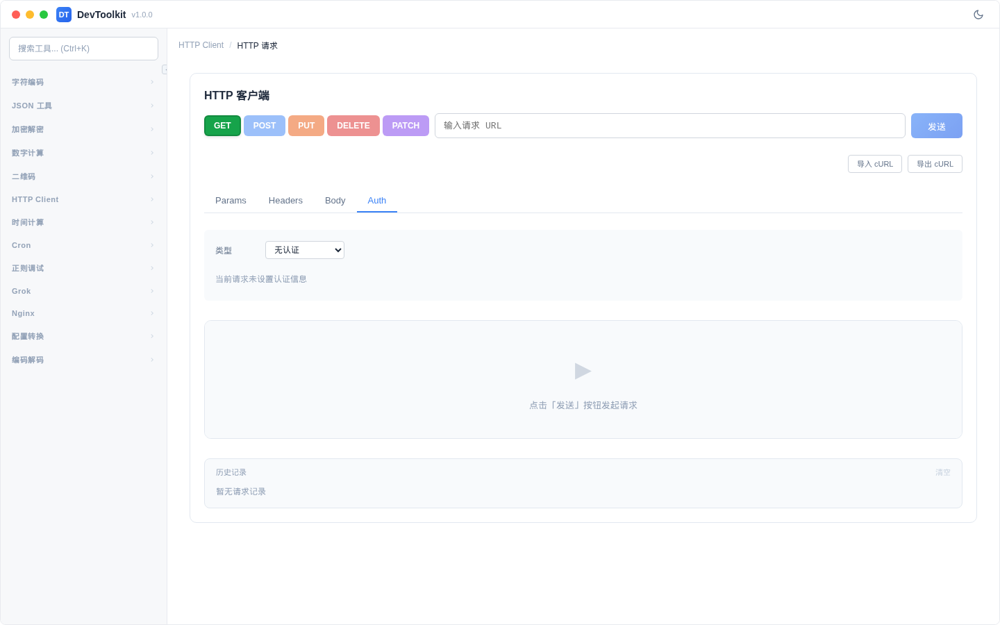

# HTTP 请求

## 功能简介
HTTP 客户端工具，支持发送各种 HTTP 请求并查看响应。

## 操作步骤
1. 选择 HTTP 方法（GET、POST、PUT、DELETE、PATCH）
2. 输入请求 URL
3. 配置请求参数（Params、Headers、Body、Auth）
4. 点击「发送」按钮
5. 查看响应结果

### HTTP 方法
| 方法 | 颜色 | 说明 |
|------|------|------|
| GET | 绿色 | 获取资源 |
| POST | 蓝色 | 创建资源 |
| PUT | 橙色 | 更新资源 |
| DELETE | 红色 | 删除资源 |
| PATCH | 紫色 | 部分更新 |

### 请求配置标签页

#### Params

- 键值对形式的查询参数
- 自动拼接到 URL 中
- 支持添加/删除参数行

#### Headers

- 键值对形式的请求头
- 默认包含 `Content-Type: application/json`
- 支持添加/删除头部行

#### Body

- 仅 POST、PUT、PATCH 方法可用
- 支持多种格式：
  - JSON（默认）
  - XML
  - 纯文本
  - 表单（x-www-form-urlencoded）

#### Auth

- **无认证**：不使用任何认证
- **Bearer Token**：输入 Bearer 令牌
- **Basic Auth**：输入用户名和密码
- **SSL 客户端证书**：
  - 单向认证：CA 证书
  - 双向认证：CA 证书 + 客户端证书 + 客户端私钥

### 响应展示
- **状态码**：HTTP 状态码和状态文本
- **响应头**：所有响应头信息
- **响应体**：响应内容（支持 JSON 语法高亮）