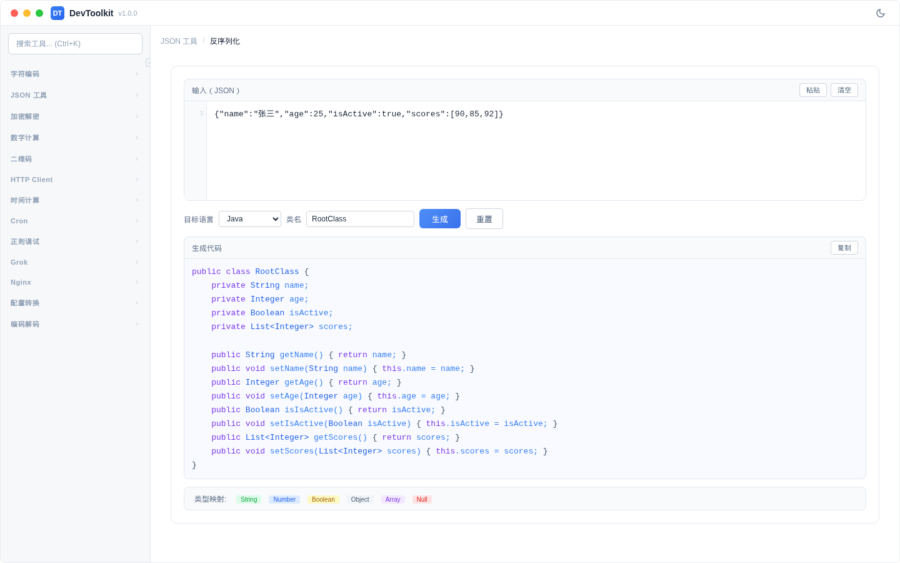

# JSON 反序列化

## 功能简介
将 JSON 数据反序列化为多种编程语言的类/结构体代码。

## 界面说明


## 操作步骤
1. 在输入区域输入 JSON 数据
2. 选择目标编程语言
3. （可选）设置类名
4. 点击「生成」按钮
5. 输出区域显示生成的代码

### 支持的语言
| 语言 | 说明 |
|------|------|
| Java | 生成 Java 类（含字段类型推断） |
| Python | 生成 Python dataclass |
| Go | 生成 Go struct |
| TypeScript | 生成 TypeScript interface |
| C# | 生成 C# class |
| Rust | 生成 Rust struct |

### 参数说明
| 参数 | 说明 |
|------|------|
| 目标语言 | 选择生成代码的编程语言 |
| 类名 | 生成的类/结构体名称 |

### 示例
输入：
```json
{"name":"张三","age":25,"isActive":true,"scores":[90,85,92]}
```

选择 Java 语言，类名 `Student`，生成：
```java
public class Student {
    private String name;
    private Integer age;
    private Boolean isActive;
    private List<Integer> scores;
}
```

### 类型推断规则
- 字符串 → String
- 整数 → Integer/Long
- 浮点数 → Double
- 布尔值 → Boolean
- 数组 → List<T>（根据元素推断泛型类型）
- 对象 → 嵌套类