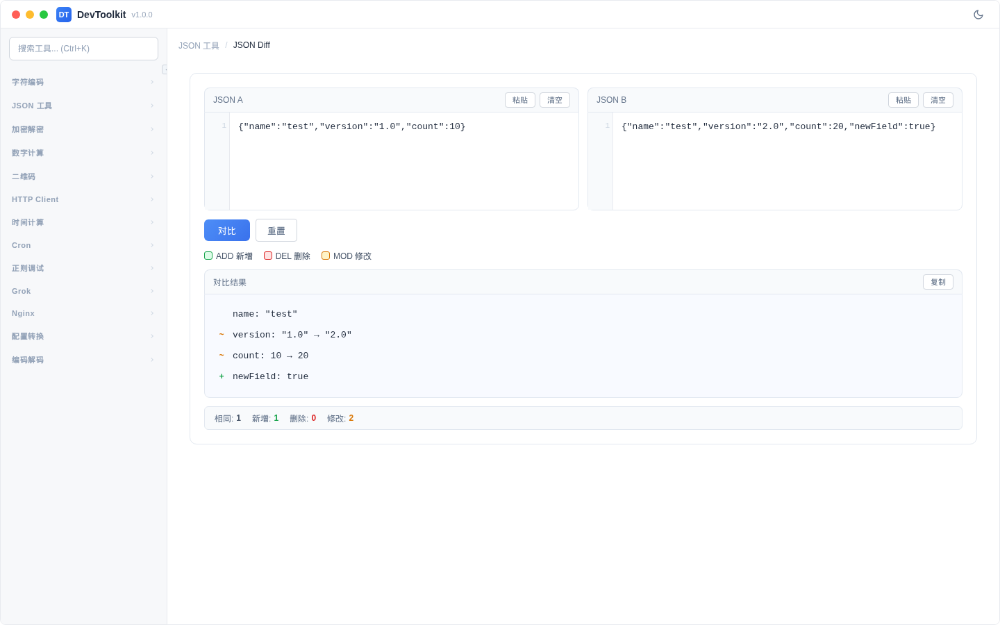

# JSON Diff

## 功能简介
对比两个 JSON 数据的差异，以可视化方式显示新增、删除、修改的字段。

## 界面说明

页面分为左右两个输入区域和一个差异结果展示区域。

## 操作步骤
1. 在左侧「JSON A」区域输入第一个 JSON
2. 在右侧「JSON B」区域输入第二个 JSON
3. 点击「对比」按钮
4. 结果区域显示差异：

### 差异类型
| 标记 | 颜色 | 含义 |
|------|------|------|
| ADD | 绿色 | JSON B 中新增的字段 |
| DEL | 红色 | JSON B 中删除的字段 |
| MOD | 黄色/橙色 | 值被修改的字段 |

### 统计信息
对比完成后显示统计：
- 相同字段数
- 新增字段数
- 删除字段数
- 修改字段数

### 快捷操作
- 每个输入区域都有「粘贴」和「清空」按钮
- 「重置」按钮清空所有内容
- 结果区域有复制按钮