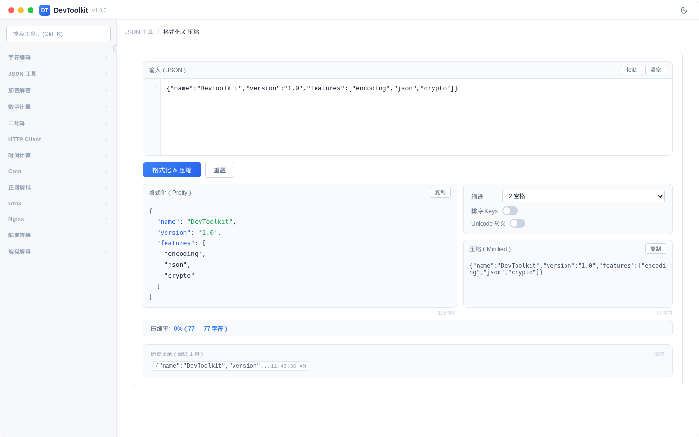

# JSON 格式化 & 压缩

## 功能简介
对 JSON 字符串进行格式化（美化）和压缩（最小化）处理，同时显示压缩率统计。

## 界面说明


页面分为上下两部分：上方为 JSON 输入区域，下方为格式化和压缩结果。

## 操作步骤
1. 在输入区域粘贴或输入 JSON 字符串
2. 点击「格式化 & 压缩」按钮
3. 下方同时显示：
   - **格式化结果**：美化后的 JSON（带缩进和语法高亮）
   - **压缩结果**：最小化后的 JSON（单行）
   - **压缩统计**：原始大小、压缩后大小、压缩率

### 参数说明
| 参数 | 说明 | 可选值 |
|------|------|--------|
| 缩进 | 格式化缩进方式 | 2 空格、4 空格、Tab |
| 排序键 | 是否按字母排序 JSON 键名 | 开/关 |
| Unicode 转义 | 是否将非 ASCII 字符转义为 \uXXXX | 开/关 |

### 示例
输入：
```json
{"name":"DevToolkit","version":"1.0","features":["encoding","json","crypto"]}
```

格式化输出（2 空格缩进）：
```json
{
  "name": "DevToolkit",
  "version": "1.0",
  "features": [
    "encoding",
    "json",
    "crypto"
  ]
}
```

### 快捷操作
- 「粘贴」按钮：从剪贴板粘贴内容
- 「清空」按钮：清空输入
- 「重置」按钮：清空所有输入和输出
- 输出区域的复制按钮：一键复制结果