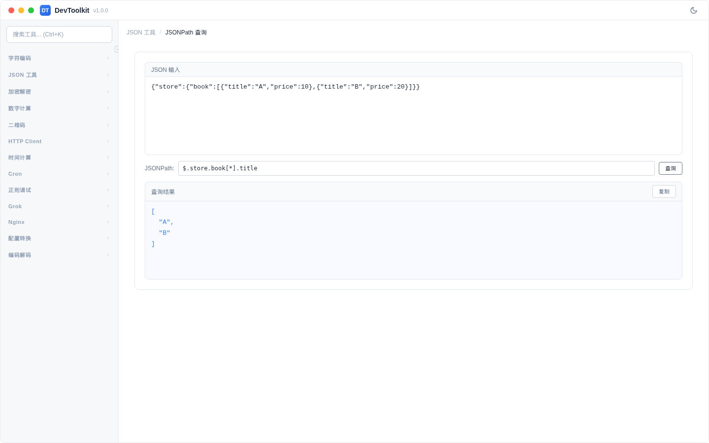

# JSONPath 查询

## 功能简介
使用 JSONPath 表达式从 JSON 数据中提取特定内容。

## 界面说明


页面分为上下两部分：上方为 JSON 输入和 JSONPath 表达式输入，下方为查询结果。

## 操作步骤
1. 在输入区域输入 JSON 数据
2. 在 JSONPath 输入框输入查询表达式
3. 点击「查询」按钮或自动触发查询
4. 结果区域显示匹配的数据

### 常用 JSONPath 表达式
| 表达式 | 说明 |
|--------|------|
| `$.store.book[*]` | 获取 store 下所有 book 元素 |
| `$.store.book[*].title` | 获取所有 book 的 title |
| `$.store.book[0]` | 获取第一个 book |
| `$.store.book[?(@.price < 10)]` | 过滤 price 小于 10 的 book |
| `$..author` | 递归查找所有 author |
| `$.store.*` | store 下的所有元素 |
| `$.store..price` | store 下所有 price（递归） |

### 示例
输入 JSON：
```json
{"store":{"book":[{"title":"A","price":10},{"title":"B","price":20}]}}
```

JSONPath：`$.store.book[*].title`

结果：`["A", "B"]`