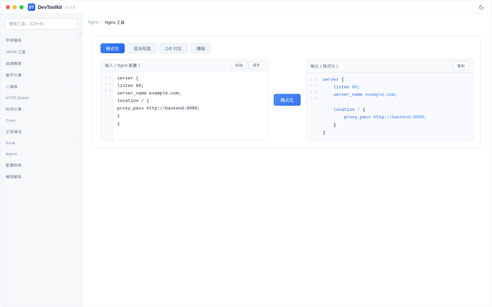
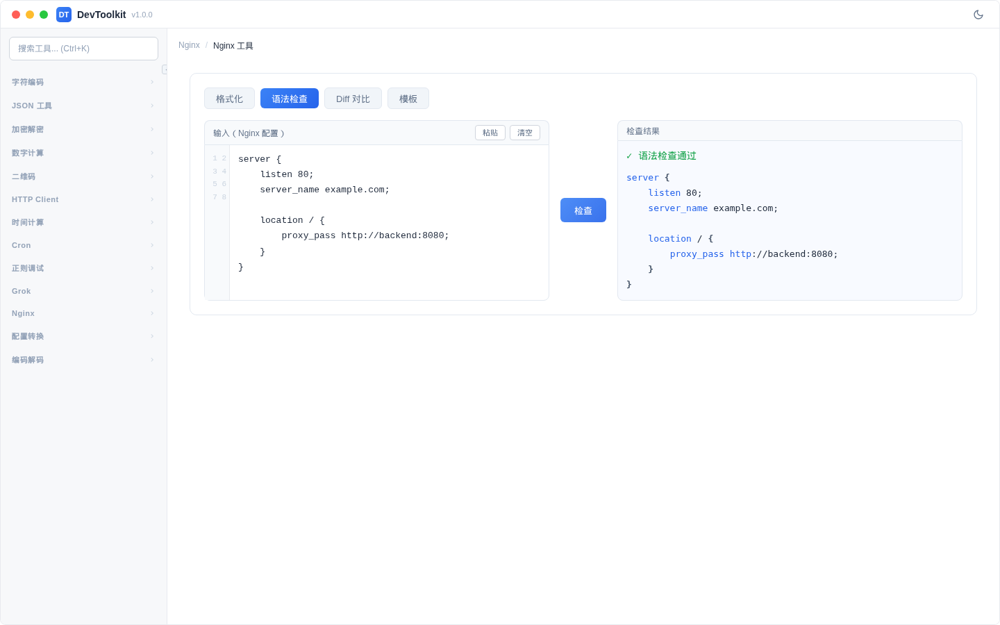
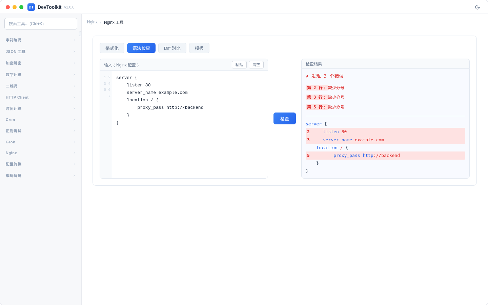
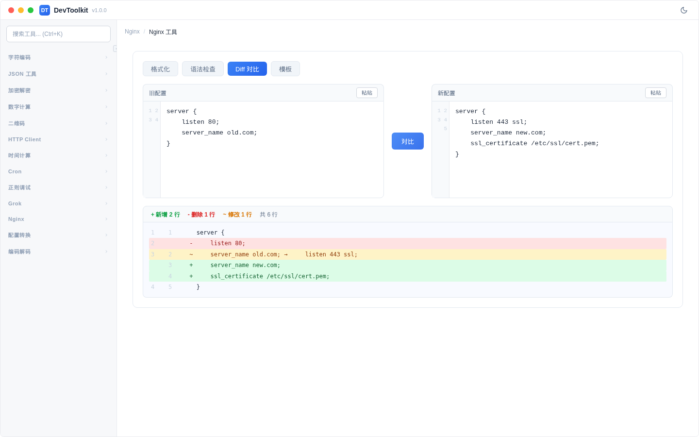
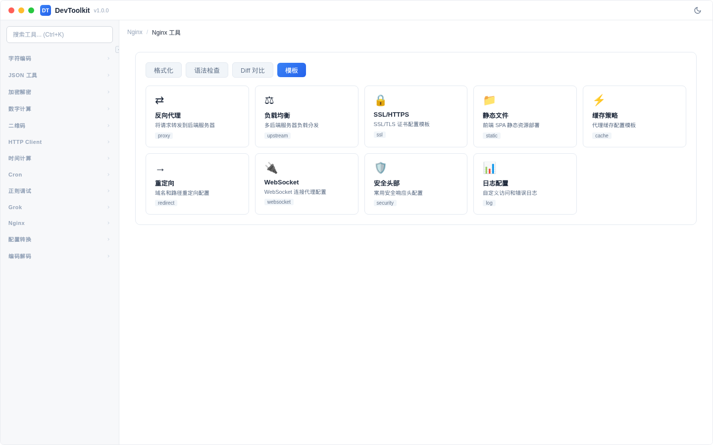

# Nginx 工具

## 功能简介
Nginx 配置文件处理工具，支持格式化、语法校验、差异对比和模板生成。

## 格式化

### 操作步骤
1. 在输入区域粘贴未格式化的 Nginx 配置
2. 点击「格式化」按钮
3. 输出区域显示缩进整齐的配置

## 语法校验

### 校验通过

### 校验失败

### 操作步骤
1. 切换到「校验」标签页
2. 输入 Nginx 配置
3. 点击「检查」按钮
4. 显示校验结果：
   - **通过**：绿色提示 + 语法高亮的配置
   - **失败**：红色提示 + 错误行号和错误描述

## Diff 对比

### 操作步骤
1. 切换到「Diff」标签页
2. 在左侧输入旧配置，右侧输入新配置
3. 点击「对比」按钮
4. 显示差异结果（等/增/删/改）

## 配置模板

### 可用模板
| 模板 | 说明 |
|------|------|
| 反向代理 | proxy_pass 转发配置 |
| 负载均衡 | upstream 多后端分发 |
| SSL/HTTPS | HTTPS 证书配置 |
| 静态文件 | 静态资源服务 |
| 缓存配置 | 代理缓存设置 |
| WebSocket | WebSocket 反向代理 |
| 限流配置 | 请求速率限制 |

点击模板卡片即可加载对应配置到编辑器。
