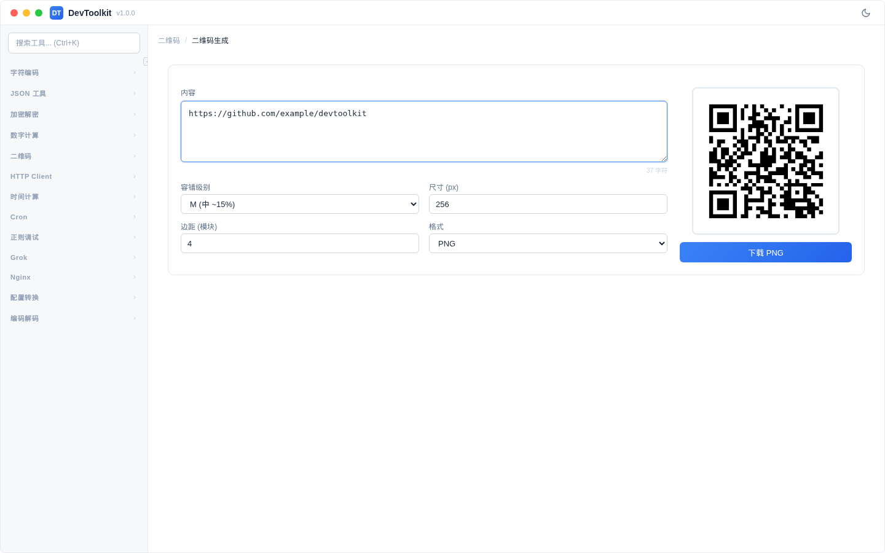

# 二维码生成

## 功能简介
将文本或 URL 内容生成为二维码图片。

## 操作步骤
1. 在输入区域输入文本或 URL
2. 实时生成二维码
3. 可下载生成的二维码图片

### 参数说明
| 参数 | 说明 | 可选值 |
|------|------|--------|
| 尺寸 | 二维码图片大小 | 多种尺寸可选 |
| 边距 | 二维码边距 | 自定义 |
| 纠错级别 | 错误纠正能力 | L（7%）、M（15%）、Q（25%）、H（30%） |
| 输出格式 | 图片格式 | PNG、SVG |

### 纠错级别说明
- **L**：约 7% 的数据可恢复
- **M**：约 15% 的数据可恢复（默认推荐）
- **Q**：约 25% 的数据可恢复
- **H**：约 30% 的数据可恢复