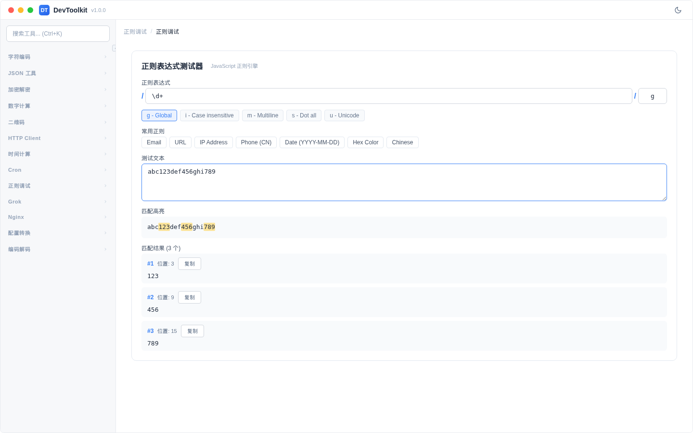

# 正则调试

## 功能简介
实时测试正则表达式，高亮显示匹配结果。

## 操作步骤
1. 在正则表达式输入框中输入模式
2. 在测试文本区域输入待匹配文本
3. 自动高亮显示匹配结果
4. 查看匹配分组信息

### 正则标志
| 标志 | 名称 | 说明 |
|------|------|------|
| g | global | 全局匹配（查找所有匹配） |
| i | ignoreCase | 不区分大小写 |
| m | multiline | 多行模式 |
| s | dotAll | `.` 匹配换行符 |
| u | unicode | Unicode 模式 |
| y | sticky | 粘性匹配 |

### 结果展示
- 匹配文本在输入区域中高亮显示
- 显示所有匹配分组
- 显示每个分组的内容和索引