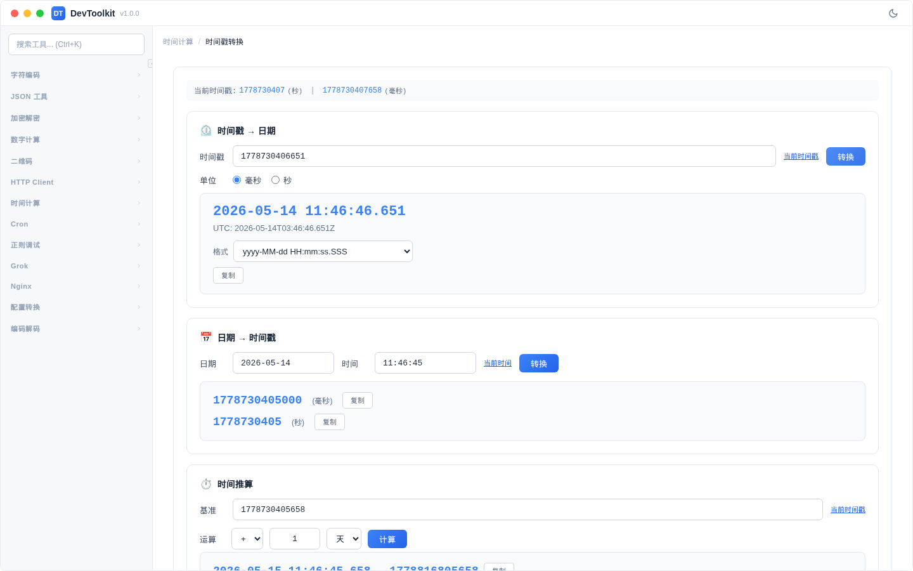
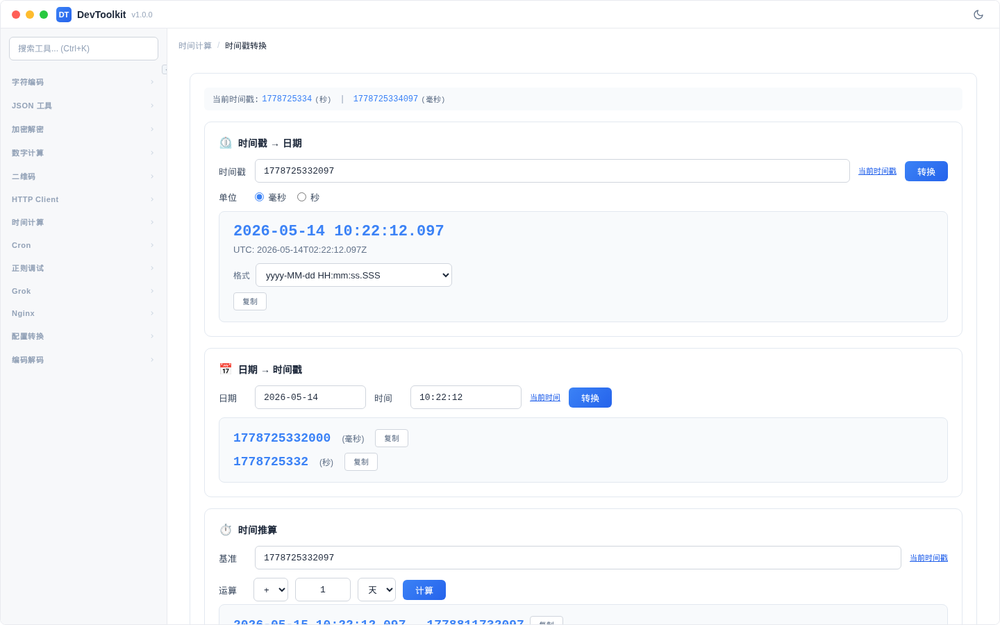

# 时间戳转换

## 功能简介
时间戳与日期时间的相互转换，支持多种日期格式。

## 时间戳 → 日期
### 操作步骤
1. 在时间戳输入框中输入时间戳
2. 选择时间戳单位（毫秒/秒）
3. 选择日期格式
4. 显示本地时间和 UTC 时间

### 支持的日期格式
| 格式 | 示例 |
|------|------|
| yyyy-MM-dd HH:mm:ss.SSS | 2024-01-15 14:30:00.000 |
| yyyy-MM-dd HH:mm:ss | 2024-01-15 14:30:00 |
| yyyy/MM/dd HH:mm:ss | 2024/01/15 14:30:00 |
| yyyyMMddHHmmssSSS | 20240115143000000 |
| yyyyMMdd | 20240115 |
| yyyy-MM-dd | 2024-01-15 |
| HH:mm:ss | 14:30:00 |
| ISO 8601 | 2024-01-15T06:30:00.000Z |
| RFC 2822 | Mon, 15 Jan 2024 06:30:00 +0000 |
| 自定义 | 用户自定义格式 |

## 日期 → 时间戳

输入日期时间，同时显示毫秒和秒级时间戳。